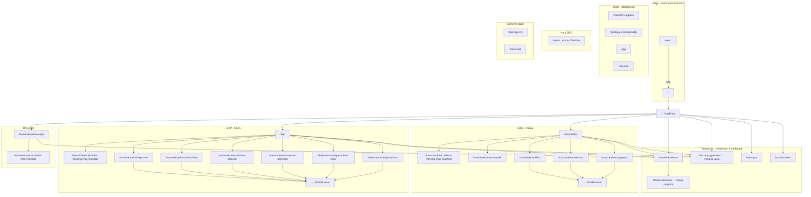
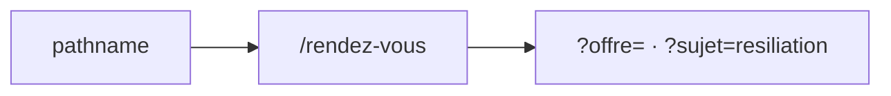
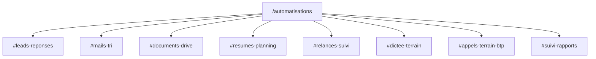

# Automatex Hub — mémo routes (agents)

> **Màj** : 2026-06-03 · **Canon** : `https://automatex-hub.com` (apex, sans `www` → 301 Netlify) · **Build** : Next 15 `output:"export"` · **`trailingSlash:false`** (URLs sans `/` final)

---

## JSON-LD (static export)

- **Global graph** : `StructuredDataServer` + `JsonLdLayout` dans un **`layout.tsx` par route** (pas de `usePathname` client).
- **Modes FAQ** (`lib/json-ld.ts` → `JsonLdFaqMode`) : `home` (`/`), `tpe` (`/automatisation-ia-tpe`), `btp` (`/btp` + pages locales BTP/devis), `mandataires` (immobilier, mandataires, légal, hub).
- **Scripts additionnels** (sans 2e FAQPage) : `BtpStructuredData`, `buildTpeAutomatisationJsonLd` (layout TPE), `LocalStructuredData`, `buildAboutPageJsonLd`.
- **Vérif post-build** : `npm run check:faqpage` (alias `node scripts/check-faqpage-html.mjs out`) — chaîné dans `npm run build`

---

## Règles — ne pas inventer de routes

| Interdit / obsolète | Utiliser à la place |
|---------------------|---------------------|
| `/tpe`, `/tpe/`, `/automatisation-tpe` | `/automatisation-ia-tpe` |
| `#pipeline-pilotage` | `#suivi-rapports` (catalogue) |
| Ancres `#contact` funnel pour CTA nav | **`/rendez-vous`** (`contactHref`, `rendezVousHref`) |
| `/accompagnement` → formulaire inline | CTA → `/rendez-vous` (contenu page conservé) |
| Préfixe `/automatisation` = tout BTP | **Faux** : `/automatisation-ia-tpe` = TPE ; BTP = `/automatisation-artisan-*`, `/automatisation-btp-orne` |
| `/api/*` (App Router) | **Aucune** page API Next ; forms → Netlify |
| `/merci` indexable | **Non** : `robots.txt` `Disallow: /merci`, absent du sitemap |

**Home `/`** : landing artisans & TPE (`HomePage`), pas le hub choix parcours. CTA hero → **`rendezVousHref()`** ; formulaire `#contact` sur la page (Netlify + webhook).

---

## Inventaire pages (24) — `app/**/page.tsx`

| Route | Rôle | Template / composant clé |
|-------|------|---------------------------|
| `/` | Landing artisans & TPE (Normandie) | `HomePage` |
| `/immobilier` | Landing mandataires (Pascal) | `ImmobilierHome` |
| `/btp` | Landing artisans BTP (Kévin) | `BtpLanding` |
| `/automatisation-ia-tpe` | Pilier TPE/PME + tarifs + contact | page + `TpeAutomatisationPricing` |
| `/automatisations` | Catalogue 20 automatisations | `AutomatisationsCatalogSections` |
| `/rendez-vous` | **Contact canonique** · formulaire prospect | `Contact` variant `hub` |
| `/accompagnement` | Offre humaine 12 mois | CTA → `/rendez-vous` |
| `/a-propos` | Fondateur / histoire | contenu statique |
| `/vos-donnees` | Transparence infra (Netlify CDN, N8N UE, Mistral) | `VosDonneesView` |
| `/merci` | Post-formulaire | **noindex implicite via robots** |
| `/mentions-legales` | LCEN | `LegalPageShell` |
| `/politique-confidentialite` | RGPD | idem |
| `/cgv` | Contrat | idem |
| `/securite` | Résumé sécurité | idem |
| `/mandataires-normandie` | SEO régional immo | hub local |
| `/mandataires-flers` | SEO local | `MandatairesLocalPage` ← `lib/local-pages.ts` |
| `/mandataires-alencon` | SEO local | idem |
| `/mandataires-argentan` | SEO local | idem |
| `/automatisation-btp-orne` | SEO BTP Orne (+ extension) | `BtpLocalPage` |
| `/automatisation-artisan-flers` | SEO BTP ville | `BtpLocalPage` ← `lib/btp-copy.ts` `BTP_LOCAL_PAGES` |
| `/automatisation-artisan-alencon` | idem | idem |
| `/automatisation-artisan-argentan` | idem | idem |
| `/devis-automatique-artisan-orne` | long-tail devis | idem |
| `/devis-automatique-artisan` | long-tail devis | idem |

**Générés au build (pas `page.tsx`)** : `/sitemap.xml` (`app/sitemap.ts`), `/robots.txt` (`public/robots.txt`), `/favicon.ico`, `/icon.png`, `/apple-icon.png`.

---

## `contactHref` / `rendezVousHref` — `lib/hub-nav.ts`

| Usage | URL |
|-------|-----|
| Nav / MegaNav (`contactHref`) | **`/rendez-vous`** (toutes pages) |
| Tarifs / offre (`rendezVousHref({ offre })`) | `/rendez-vous?offre=declic\|systeme\|pilote\|sur-mesure` |
| Résiliation (`rendezVousHref({ sujet: "resiliation" })`) | `/rendez-vous?sujet=resiliation` |

Formulaire Netlify : nom **`contact`** · webhook inchangé · redirect **`/merci`**. Sections `#contact` optionnelles sur landings (immo/btp/TPE) ; **CTA booking** pointent vers `/rendez-vous`.

---

## Ancres hash — funnels

| Page | IDs DOM utiles |
|------|----------------|
| `/immobilier` | `#hero`, `#solution`, `#demo`, `#pricing`, `#faq`, `#contact` |
| `/btp` | `#hero`, `#demo`, `#solution`, `#pricing`, `#faq`, `#contact` |
| `/automatisation-ia-tpe` | `#automatisations`, `#tarifs`, `#faq`, `#contact` (via `Contact`) |
| `/accompagnement` | `#contact` |
| `/automatisations` | voir ci-dessous |

Query contact : `/rendez-vous?offre=declic|systeme|pilote|sur-mesure` (grille unifiée).

---

## Ancres `/automatisations` — `lib/automations-catalog.ts` → `categoryToAnchor()`

| Catégorie affichée | `id` section |
|--------------------|--------------|
| Leads & réponses | `#leads-reponses` |
| Mails & tri | `#mails-tri` |
| Documents & Drive | `#documents-drive` |
| Résumés & planning | `#resumes-planning` |
| Relances & suivi | `#relances-suivi` |
| Dictée & terrain | `#dictee-terrain` |
| Appels & terrain BTP | `#appels-terrain-btp` |
| **Suivi & Rapports Métier** | **`#suivi-rapports`** |

Constante : `CATEGORY_SUIVI_RAPPORTS = "Suivi & Rapports Métier"`.

---

## Nav globale — `SITE_NAV` (`lib/hub-nav.ts`)

Ordre footer/header principal : `/automatisation-ia-tpe` · `/immobilier` · `/btp` · `/automatisations` · `/accompagnement` · `/vos-donnees` · `/a-propos`

Mega-menu catalogues : `lib/mega-nav-data.ts` (liens `#` catalogue ci-dessus).

---

## Sitemap vs pages

`sitemap.ts` liste **22 URLs** (+ `/` = 23 contenus) — **exclut** `/merci`. Priorités max : `/`, `/immobilier`, `/btp`, `/accompagnement`, `/automatisation-ia-tpe` (0.95).

Toute **nouvelle** route marketing → ajouter : `app/<slug>/page.tsx` + entrée `app/sitemap.ts` + `scripts/check-routes.sh` + `scripts/audit-routes.mjs`.

---

## Vérification (obligatoire après changement route)

```bash
npm run build
npx serve out -p 3000   # ou next start si non-export local
bash scripts/check-routes.sh http://127.0.0.1:3000
node scripts/audit-routes.mjs   # prod option AUDIT_BASE_URL=
```

**Deploy** : Netlify `publish = out` · redirect `www` → apex · pas de SSR.

---

## Schéma des routes



### CTA navigation (`contactHref`)



### Catalogue `/automatisations` (sections)



---

## Arborescence mentale (1 ligne)

`/` hub → **immo** `/immobilier` + locals `/mandataires-*` | **btp** `/btp` + locals `/automatisation-*` `/devis-*` | **tpe** `/automatisation-ia-tpe` | **catalogue** `/automatisations#*` | **trust** `/vos-donnees` `/accompagnement` | **legal** 4 pages | **merci** off-SEO
