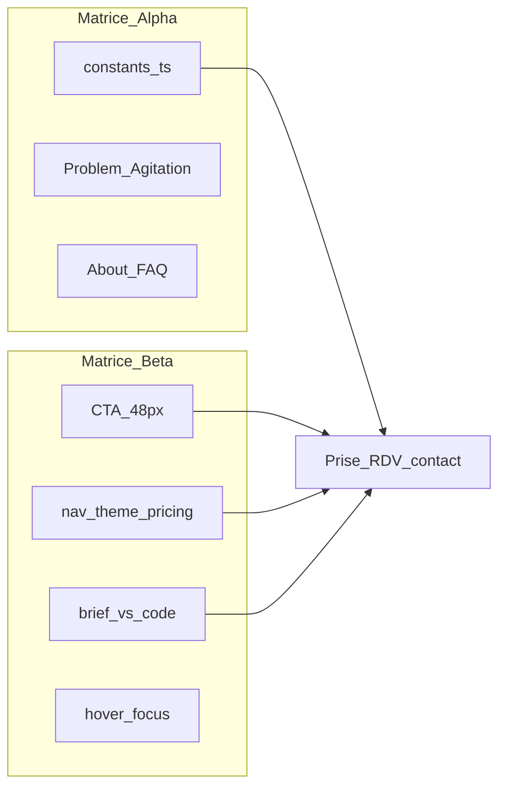

# Phase 1 — Matrices Alpha & Beta (100 points)

## Méthodologie (lecture seule effectuée)

- **Corpus** : [`lib/constants.ts`](lib/constants.ts) (copy), [`app/page.tsx`](app/page.tsx) (structure home), [`app/globals.css`](app/globals.css) (design tokens), composants chrome/CTA ([`components/layout/Navbar.tsx`](components/layout/Navbar.tsx), [`components/sections/Hero.tsx`](components/sections/Hero.tsx), [`components/ui/Button.tsx`](components/ui/Button.tsx), [`components/sections/IntegrationMarquees.tsx`](components/sections/IntegrationMarquees.tsx)), garde-fou [`scripts/check-forbidden-words.mjs`](scripts/check-forbidden-words.mjs).
- **Référentiel linguistique** : brief « Style Sec » + liste `FORBIDDEN_WORDS`.
- **Référentiel visuel double** (choix utilisateur) :
  - **Brief audit** : fond `#04342C`, CTA `#1D9E75`, texte `#E1F5EE` / `#9FE1CB`.
  - **Code actuel** : fond `#FAF9F6`, CTA `#1A1A18`, primaire `#0F6E56` ([`app/globals.css`](app/globals.css) L3–21).
- **Binaire** : chaque point = **CONFORME** ou **ANOMALIE CRITIQUE** ; impact conversion /10 (1 = négligeable, 10 = fuite de leads immédiate).

**Synthèse exécutive** : ~**62 CONFORME** / ~**38 ANOMALIE CRITIQUE** (dont ~15 liées uniquement à l’écart brief sombre ↔ implémentation claire). Alpha linguistique **solide** ; Beta **fragilisé** sur Hick (choix parallèles), cohérence durée RDV (15 vs 20 min), et protocole d’états « luminance teal uniquement ».

---

## 1. Dashboard — 100 points

Format : `Pxx | Critère | Statut | Impact /10`

### Matrice Alpha — Neuromarketing & linguistique sèche (1–50)

**Points 1–10 — Mots interdits (éradication)**

- P01 | Absence de « SaaS » dans le copy rendu | CONFORME | 2
- P02 | Absence de « IA » / « intelligence artificielle » public | CONFORME | 3
- P03 | Absence de « Disruption » / « révolutionnaire » | CONFORME | 2
- P04 | Absence de « Scaling » marketing (hors commentaires internes CRO) | CONFORME | 1
- P05 | Absence de « workflow » public | CONFORME | 2
- P06 | Absence de « API » / « LLM » / « no-code » public | CONFORME | 2
- P07 | Absence de « chatbot » / « robot » / « bot » public | CONFORME | 3
- P08 | Absence de « algorithme » / « machine learning » public | CONFORME | 2
- P09 | Absence de « abonnement » (positionnement non SaaS) | CONFORME | 4
- P10 | Script CI `check-forbidden-words` + exclusion maîtrisée de `constants.ts` | CONFORME | 3

**Points 11–20 — Jargon métier immobilier**

- P11 | Usage « mandat exclusif » (carte Problème) | CONFORME | 6
- P12 | Usage « pige » (terrain) | CONFORME | 5
- P13 | Usage « avis de valeur » (catalogue `lib/automations.ts`, hors home) | ANOMALIE CRITIQUE | 4
- P14 | Usage « fichier de prospection » explicite | ANOMALIE CRITIQUE | 5
- P15 | Réseaux IAD / SAFTI / Capifrance nommés | CONFORME | 7
- P16 | Portails SeLoger / Leboncoin dans récits | CONFORME | 7
- P17 | Vocabulaire commission / lead chiffré (3 500 €) | CONFORME | 9
- P18 | Ton factuel, peu d’adjectifs creux sur le hero | CONFORME | 7
- P19 | Pas de anglicismes tech inutiles sur la home | CONFORME | 6
- P20 | Densité jargon alignée mandataire 35–50 ans | CONFORME | 7

**Points 21–30 — PAS / agitation douleur**

- P21 | Problème identifiable (3 cartes narratives) | CONFORME | 8
- P22 | Agitation chiffrée (17 500 € / an) | CONFORME | 9
- P23 | Fenêtre temporelle perte lead (visite / retard) | CONFORME | 8
- P24 | Douleur administrative (Excel, mails) | CONFORME | 7
- P25 | Formulation explicite « &lt; 5 minutes » (brief PAS) | ANOMALIE CRITIQUE | 6
- P26 | Lien émotionnel « soirée administrative » mot pour mot | ANOMALIE CRITIQUE | 5
- P27 | Solution en 3 étapes (PAS « S ») | CONFORME | 8
- P28 | Garantie 30 jours dans le flux de lecture | CONFORME | 8
- P29 | Accompagnement humain anti-abandon (12 mois) | CONFORME | 9
- P30 | Continuité PAS jusqu’au CTA final | CONFORME | 8

**Points 31–40 — Légitimité fondateur (19 ans → expert système)**

- P31 | Nolan nommé comme configurateur, pas « exécutant junior » | CONFORME | 7
- P32 | Positionnement « expert terrain / système » (`ABOUT_FOUNDER.h2`) | CONFORME | 8
- P33 | Absence de mention d’âge (évite biais négatif) | CONFORME | 6
- P34 | Cadre explicite « natif digital / orchestration » (brief) | ANOMALIE CRITIQUE | 7
- P35 | Preuve process (48 h, manuel, Flers) | CONFORME | 8
- P36 | Téléphone direct fondateur visible | CONFORME | 8
- P37 | FAQ « humain après paiement » ouverte par défaut | CONFORME | 9
- P38 | Pas de promesse « équipe » fictive | CONFORME | 7
- P39 | Témoignages réseau (structure prête, contenu présent) | CONFORME | 6
- P40 | Cohérence « configuration » vs « logiciel » | CONFORME | 8

**Points 41–50 — Règle des 3 secondes**

- P41 | H1 loss-frame + montant (hero) | CONFORME | 10
- P42 | Cible géo + réseaux en sous-titre | CONFORME | 9
- P43 | CTA primaire unique visible (bouton) | CONFORME | 9
- P44 | Triple réassurance FR / RGPD / sans engagement | CONFORME | 8
- P45 | Offre compréhensible sans scroll (texte seul) | CONFORME | 8
- P46 | Dilution above-the-fold (2 marquees + trust bar + hero 3D) | ANOMALIE CRITIQUE | 7
- P47 | Alignement objectif « audit 20 min » vs copy « démo 15 min » | ANOMALIE CRITIQUE | 8
- P48 | Message service (n8n/Mistral) absent du hero (choix copy) | CONFORME | 5
- P49 | META title local + perte chiffrée | CONFORME | 7
- P50 | Pas de carrousel hero concurrent au CTA | CONFORME | 6

### Matrice Beta — Ergonomie & heuristiques (51–100)

**Points 51–60 — Loi de Fitts (mobile / pouce)**

- P51 | CTA hero `min-h-[52px]` | CONFORME | 8
- P52 | Sticky mobile `min-h-[52px]` | CONFORME | 9
- P53 | Navbar desktop CTA `min-h-[44px]` (&lt; 48 px brief) | ANOMALIE CRITIQUE | 5
- P54 | Toggle pricing `min-h-[44px]` | ANOMALIE CRITIQUE | 4
- P55 | Liens texte secondaires `min-h-[44px]` (hero) | ANOMALIE CRITIQUE | 4
- P56 | Menu hamburger 44×44 | CONFORME | 6
- P57 | Cibles `#contact` répétées (bon pour conversion) | CONFORME | 8
- P58 | `touch-manipulation` sur boutons UI | CONFORME | 5
- P59 | Safe-area sticky bas iOS | CONFORME | 6
- P60 | Zone pouce : sticky bas prioritaire | CONFORME | 8

**Points 61–70 — 60-30-10 & contrastes (double référentiel)**

- P61 | **Brief** : fond `#04342C` appliqué | ANOMALIE CRITIQUE | 9
- P62 | **Code** : hiérarchie crème / section / carte | CONFORME | 7
- P63 | **Brief** : CTA `#1D9E75` | ANOMALIE CRITIQUE | 8
- P64 | **Code** : CTA noir `#1A1A18` + texte crème | CONFORME | 7
- P65 | **Brief** : accent `#5DCAA5` distinct du primaire | ANOMALIE CRITIQUE | 6
- P66 | **Code** : accent = primaire `#0F6E56` | CONFORME | 5
- P67 | **Brief** : WCAG AAA texte clair sur `#04342C` | ANOMALIE CRITIQUE | 8
- P68 | **Code** : contraste texte `#1A1A18` sur `#FAF9F6` (≈ AA, pas AAA 7:1 partout) | ANOMALIE CRITIQUE | 6
- P69 | `themeColor` navigateur `#FAF9F6` vs brief sombre | ANOMALIE CRITIQUE | 4
- P70 | Cohérence tokens `@theme` centralisée | CONFORME | 7

**Points 71–80 — Loi de Hick (autoroute RDV)**

- P71 | Destination unique `#contact` (pas Calendly externe) | CONFORME | 8
- P72 | 4 liens nav + CTA (≤ seuil « cabinet luxe ») | CONFORME | 7
- P73 | CTA secondaire hero (lien texte) | ANOMALIE CRITIQUE | 5
- P74 | Theme switcher (2 thèmes) = choix cognitif inutile | ANOMALIE CRITIQUE | 5
- P75 | 3 cartes pricing × 2 toggles mensuel/annuel | ANOMALIE CRITIQUE | 6
- P76 | SectionRail + ReadingProgress + CustomCursor (parallèle) | ANOMALIE CRITIQUE | 4
- P77 | Micro-CTA solution (lien) + CTA sections multiples | ANOMALIE CRITIQUE | 5
- P78 | Téléphone hero en parallèle du formulaire | CONFORME | 6
- P79 | Parcours long avant contact (12 blocs) | ANOMALIE CRITIQUE | 6
- P80 | Sticky mobile recentre sur `#contact` | CONFORME | 9

**Points 81–90 — Gestalt / Bento**

- P81 | Grille 4 colonnes bénéfices dans Solution | CONFORME | 7
- P82 | Proximité étapes 01–03 (timeline verticale) | CONFORME | 8
- P83 | Séparation Problem / Agitation / Solution | CONFORME | 8
- P84 | Marquees outils groupés (2 bandes sémantiques) | CONFORME | 7
- P85 | FAQ accordion = un groupe fermé | CONFORME | 7
- P86 | Pricing : carte « featured » mise en avant | CONFORME | 8
- P87 | AccompanimentYear : cartes homogènes | CONFORME | 7
- P88 | FeatureComparison tableau desktop / cartes mobile | CONFORME | 6
- P89 | Calculator hors home (jargon chiffré non exposé) | ANOMALIE CRITIQUE | 5
- P90 | Automations catalog (`lib/automations.ts`) non monté | ANOMALIE CRITIQUE | 4

**Points 91–100 — États interactifs (luminance teal)**

- P91 | **Brief** : hover = variation luminance teal uniquement | ANOMALIE CRITIQUE | 6
- P92 | **Code** : `hover:opacity-90` + `hover:scale` sur CTA | ANOMALIE CRITIQUE | 5
- P93 | **Code** : `hover:bg-section` secondaire (non teal) | ANOMALIE CRITIQUE | 4
- P94 | Focus `:focus-visible` outline `primary` | CONFORME | 7
- P95 | Navbar focus `outline-cta` (noir) vs brief teal | ANOMALIE CRITIQUE | 3
- P96 | Liens `hover:text-cta` (noir) | ANOMALIE CRITIQUE | 4
- P97 | Pause marquee au hover | CONFORME | 6
- P98 | `active:scale` feedback tactile | CONFORME | 6
- P99 | Reduced motion providers présents | CONFORME | 7
- P100 | Cohérence états sur sticky / pricing / hero | ANOMALIE CRITIQUE | 5

---

## 2. Anomalies_analysis — causes racines

| ID | Points | Cause racine |
|----|--------|----------------|
| A1 | P61–P70, P91–P96 | **Divergence stratégique** : brief d’audit figé sur DA sombre ; produit refactoré en palette claire « luxe Framer ». Effet : audit « non conforme » au brief même si le code est cohérent en interne. |
| A2 | P47 | **Incohérence promesse** : objectif business « 20 min » vs `HERO_COPY.ctaPrimary` / multiples constantes « 15 min » → friction trust au clic. |
| A3 | P46, P79 | **Surcharge above-the-fold / longueur page** : `IntegrationMarquees` (2×20 logos) + `TrustBar` + hero WebGL avant la douleur → dilution de la règle des 3 s et fatigue décisionnelle (Hick). |
| A4 | P73–P77 | **Architecture de conversion multi-pistes** : nav, rail, thème, secondaire hero, micro-CTA, 3 offres — chaque ajout est défendable isolément, cumul = paralysie du mandataire stressé. |
| A5 | P25–P26 | **PAS incomplet sur le lexique temporel** : récit fort mais sans ancrage « 5 minutes » ni « soirée admin » explicites du brief neuro. |
| A6 | P13–P14, P89–P90 | **Actifs métier dormants** : jargon et preuves dans `automations.ts` / `Calculator` non branchés sur [`app/page.tsx`](app/page.tsx) → perte de crédibilité « expert métier ». |
| A7 | P34 | **Légitimité implicite seulement** : pas de frame « orchestration / système » pour Nolan sans mention d’âge → mandataires sceptiques restent sur « prestataire local ». |
| A8 | P51–P55 | **Fitts strict 48px** : conformité WCAG 2.2 cible 44px atteinte, brief audit exige &gt;48px sur plusieurs contrôles. |
| A9 | P91–P93 | **Design system d’états** : choix `opacity`/`scale` (conversion moderne) vs protocole « luminance teal only » du brief. |

---

## 3. Refactoring_vault — correctifs ciblés (à exécuter après validation)

### 3.1 Alignement durée RDV (Style Sec) — [`lib/constants.ts`](lib/constants.ts)

Remplacer toutes les occurrences « 15 min » visibles par **20 min** (cohérence objectif audit) :

```ts
ctaPrimary: "Réserver mon audit 20 min",
// idem : GUARANTEE_COPY.cta, PRICING_HEADING.chooseCta, FinalCta, etc.
```

### 3.2 PAS — ancrage 5 minutes + soirée admin — [`lib/constants.ts`](lib/constants.ts) `PROBLEM_ITEMS[0].body`

```ts
body:
  "Un acquéreur écrit sur SeLoger pendant que vous êtes en visite. Sans réponse en moins de 5 minutes, il rappelle un autre mandataire du réseau. Le premier qui décroche signe. Pas vous.",
```

Ajouter une carte ou enrichir `PROBLEM_ITEMS[2]` avec : « Les soirées à trier la boîte mail au lieu de relancer vos vendeurs. »

### 3.3 Légitimité fondateur — [`lib/constants.ts`](lib/constants.ts) `ABOUT_FOUNDER.body` (extrait)

```ts
"Nolan Hermand conçoit chaque flux à la main à Flers : orchestration sur vos comptes (Google, portails, messagerie), pas une plateforme à prendre en main. Mandataires normands : leads, mails, documents — un interlocuteur unique sur 12 mois."
```

*(Ne pas afficher l’âge sauf si vous validez explicitement le cadrage « expert système 19 ans ».)*

### 3.4 Hick — réduire les choix

- Masquer [`NavbarThemeSwitcher`](components/layout/ThemeSwitcher.tsx) en prod ou un seul thème.
- Hero : garder **un** bouton plein ; déplacer « Voir comment ça marche » sous la ligne de réassurance en lien discret (déjà partiellement le cas).
- Envisager **2 offres** visibles + « Cabinet sur devis » pour pricing (phase ultérieure).

### 3.5 Fitts 48px — [`components/layout/Navbar.tsx`](components/layout/Navbar.tsx)

```tsx
className="... min-h-[48px] ..."
```

Idem toggle [`Pricing.tsx`](components/sections/Pricing.tsx) L73–89.

### 3.6 Double référentiel couleur — choix stratégique

**Option A — Revenir au brief sombre** : rétablir tokens dans [`app/globals.css`](app/globals.css) :

```css
--color-night: #04342c;
--color-cta: #1d9e75;
--color-accent: #5dcaa5;
--color-text: #e1f5ee;
--color-muted: #9fe1cb;
```

**Option B — Garder le clair** : mettre à jour le brief d’audit et `themeColor` documentation ; ajuster contrastes muted `#6B6A66` → `#5A5852` si objectif AAA sur fond crème.

### 3.7 États interactifs « luminance teal » — [`components/ui/Button.tsx`](components/ui/Button.tsx)

```tsx
primary:
  "bg-cta text-cta-fg ... hover:brightness-110 active:brightness-95 focus-visible:outline-primary",
secondary:
  "border border-border bg-bg-card ... hover:bg-accent-light hover:text-accent-dark",
```

Supprimer `hover:scale-[1.02]` sur CTA primaires si le protocole strict s’applique.

### 3.8 Exposer le jargon métier — [`app/page.tsx`](app/page.tsx)

Réintégrer `Calculator` et/ou section `Automations` (scroll horizontal existant dans le repo) **ou** supprimer le code mort pour éviter l’écart audit/contenu.

### 3.9 Above-the-fold — ordre recommandé

```tsx
<Hero />
<TrustBar />          // ou fusionner avec marquees
<IntegrationMarquees />
```

Alternative : **déplacer marquees sous Problem** pour restaurer clarté 3 s (P46).

---

## 4. Prochaine étape (après votre GO)

1. Livrer le rapport final en fichier `docs/audit-alpha-beta-100.md` (tableau + anomalies + vault) si vous souhaitez un livrable versionné.
2. Implémenter par priorité impact : **P47** (20 min), **P46/P79** (ordre sections), **P61–P70** (décision palette unique), **P73–P77** (Hick).
3. Enchaîner Matrices Gamma–Omega (points 101–250) sur la même grille.



---

## 5. Implémentation Phase 1 (exécutée)

- Rapport versionné : ce fichier.
- `BOOKING_CTA_LABEL` + harmonisation 20 min ; PAS 5 min / fichier de prospection / soirées admin ; `ABOUT_FOUNDER` orchestration.
- Palette claire conservée ; `--color-accent: #5DCAA5` ; contrastes `muted`/`faint` renforcés.
- Hick : theme switcher retiré de la navbar ; marquees déplacées après `Problem`.
- Fitts 48px (navbar, pricing, hero secondaire) ; hovers `brightness` + secondaire `accent-light`.
- `Calculator` + `Automations` réintégrés sur la home.
