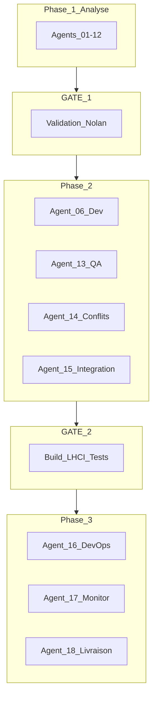

# Automatex Hub — Analyse orchestration complète (Phases 0 → 3)

**Document unique** · Site : automatex-hub.com · **Code de référence :** commit `4022918`  
**Date d’analyse :** 2026-05-19 · **Méthode :** lecture repo + prod + brief multi-agents (Module 0)

---

## Table des matières

1. [Module 0 — Source de vérité](#1-module-0--source-de-vérité)
2. [Vue d’ensemble des phases](#2-vue-densemble-des-phases)
3. [Phase 1 — Analyse (Agents 01–12)](#3-phase-1--analyse-agents-0112)
4. [GATE 1 — Sortie de Phase 1](#4-gate-1--sortie-de-phase-1)
5. [Phase 2 — Implémentation & validation (Agent 06 + 13–15)](#5-phase-2--implémentation--validation-agent-06--1315)
6. [GATE 2 — Sortie de Phase 2](#6-gate-2--sortie-de-phase-2)
7. [Phase 3 — Déploiement & exploitation (Agents 16–18)](#7-phase-3--déploiement--exploitation-agents-1618)
8. [Matrice état actuel vs cible](#8-matrice-état-actuel-vs-cible)
9. [Annexes JSON (Phase 1)](#9-annexes-json-phase-1)
10. [Décisions Nolan requises](#10-décisions-nolan-requises)

---

## 1. Module 0 — Source de vérité

| Élément | Brief produit | État repo (écart) |
|---------|---------------|-------------------|
| Produit | Systèmes + accompagnement Nolan · Flers · Orne | Aligné copy/NAP |
| Cibles | Mandataires IAD/SAFTI… + artisans BTP Orne | Landings `/immobilier`, `/btp` + SEO local |
| Stack | Next 14 App Router | **Next 15.5** · `output: export` · Netlify `out/` |
| Palette | #0D0D0D / #FF8200 global | **Crème/vert** (`app/globals.css`) ; sombre sur `LiveDemoBlock`, `AutomationCard` |
| Offres | DÉCLIC 99€ … FULL 449€ | **Départ / Essentiel / Pro / Full / Cabinet** (`lib/constants.ts`, `lib/btp-copy.ts`) |
| Mots interdits | workflow, API, SaaS… | `npm run check:words` ; URL `/automatisations` conservée pour SEO |
| Garantie | 30j remboursé | `GuaranteeXL` + copy à-propos |

**Arbitrage validé :** ne pas rebrand global ; Module 0 prime sur le **produit et le wording**, pas sur l’imposition de la palette sombre partout.

---

## 2. Vue d’ensemble des phases



| Phase | Objectif | Statut aujourd’hui |
|-------|----------|-------------------|
| **1** | Rapports + backlog priorisé | **Fait** (contenu ci-dessous) |
| **GATE 1** | Nolan valide backlog | **En attente** |
| **2** | Code + QA + intégration | **Non démarré** (partiellement couvert par `4022918` hors orchestration) |
| **GATE 2** | Build 0 erreur · LHCI · forms | **Non prouvé** sur branche à jour |
| **3** | CI remote · monitoring · rapport v1.0.0 | **Partiel** (Netlify prod OK ; CI local non poussé) |

---

## 3. Phase 1 — Analyse (Agents 01–12)

### 3.1 Inventaire technique

**Pages commerciales (6)**

| URL | Rôle | Formulaire |
|-----|------|------------|
| `/` | Hub bifurcation immo/BTP | CTA → `/immobilier#contact` |
| `/immobilier` | Funnel mandataires | Netlify `contact` |
| `/btp` | Funnel artisans | `contact` variant btp |
| `/accompagnement` | Rassurance humaine | `contact-accompagnement` |
| `/automatisations` | Catalogue (17 fiches) | CTA → **`/btp#contact` seulement** (faille CRO) |
| `/a-propos` | Confiance Nolan | Liens contact |

**Nav :** `SITE_NAV` + CTA « Réserver 20 min » via `contactHref(pathname)` (`lib/hub-nav.ts`).

**Parcours sections (résumé)**

- **Immo :** Hero → … → LiveDemo → MotionDemo → Featured catalog → … → Pricing → FAQ → FeatureGrid → Contact + sticky.
- **BTP :** Hero → pain → démos → solution + LiveDemo×2 → featured → BtpRoiStats → pricing → FAQ SSR → Contact.
- **Hub :** CTA unique « Nolan me rappelle sous 24 h » (post-audit).

**Prod (curl)**

- Routes principales : OK (200/301).
- `/assets/images/hero-atmosphere.webp` : **404** (plus de référence dans le code).
- `/assets/integrations/leboncoin.svg` : **200**.

**Lighthouse (archives)**

- `audits/baseline-mobile-prod.json` (home, **avant** derniers gros changements) : Perf **77**, A11y **97**, BP **96**, SEO **100**.
- `rapport-livraison.md` indique **99 / 100 / 100 / 100** après correctifs contraste — **à re-mesurer** après déploiement `4022918` (nouvelles pages JS lourdes immo/btp).

**Outils repo déjà présents (Phase 2 s’appuiera dessus)**

- `npm run build`, `check:words`, `check-animation-weight.sh`, `check-routes.sh`, `audit-routes.mjs`, `lighthouserc.js`, `audit:lighthouse`.

---

### 3.2 Agent 01 — Product Analyst

**Gap promesse → démo**

| Promesse | Démo ? | Action Phase 2 |
|----------|--------|----------------|
| Lead &lt; 2 min | Oui (LiveDemo + Motion) | Aligner textes catalogue |
| BTP 90s / devis | Oui | Idem |
| 20+ automatisations | **Non** (17) | +3 fiches (alerte mail +2h, anniversaire signature, récap dossier) |
| Photo Nolan | Placeholder NH | `nolan-photo.webp` |
| Nolan mensuel | Partiel | Détail 20 min sur `/accompagnement` |
| Offres DÉCLIC vs Départ | Écart naming | Décision Nolan |

**Frictions :** CTA catalogue BTP-only ; prix tardif sur accompagnement ; steps catalogue trop génériques vs `lib/live-demo.ts`.

---

### 3.3 Agent 02 — CRO

| Fuite | Impact | Fix |
|-------|--------|-----|
| `/automatisations` → btp#contact | **Élevé** | Dual CTA immo/BTP |
| Accompagnement sans prix fold | Moyen | Bandeau « dès 99€/mois inclus » |
| Double démo immo | Faible | Titres « simulation texte » vs « animation » |

**Social proof (0 client) :** stats FFB/FNAIM/CAPEB, transparence lancement, démos — ajouter bandeau hub + bullets garantie 30j près forms.

---

### 3.4 Agent 03 — SEO & GEO

- **P0 keywords :** mandataire IAD Orne → `/immobilier` ; plombier Flers → page locale BTP.
- **On-page :** title immo générique → inclure IAD/SAFTI + délai réponse.
- **Technique :** `/automatisations` dans **sitemap** (oui) mais **absent** de `check-routes.sh` et `audit-routes.mjs` (non).
- **JSON-LD :** FAQPage immo + BTP OK ; optional ItemList catalogue.
- **GEO :** blocs Q/R Nolan / prix / OVHcloud à renforcer (footer ou à-propos).

---

### 3.5 Agent 04 — UX

- Personas Pascal / Kévin / Thierry : photo, longueur page BTP, téléphone haut à-propos.
- Confusion `/automatisation-*` (SEO) vs `/automatisations` (catalogue) → label nav « Catalogue ».
- Menu mobile Framer : focus trap manquant (Phase 2).

---

### 3.6 Agent 05 — Copywriter

- Hub H1 plus concret (visite/chantier).
- Catalogue = messages LiveDemo (noms, Flers, €).
- 3 FAQ : habitudes · secrétaire · 19 ans.
- Submit forms : « Nolan me rappelle sous 24 h ».

---

### 3.7 Agent 07 — Performance

| Signal | Valeur | Cible orchestration |
|--------|--------|---------------------|
| JS FL `/immobilier` | ~220 kB | Réduire (lazy GSAP/Three/MotionDemo) |
| JS FL `/btp` | ~194 kB | Idem |
| LHCI URLs | 4 pages | **Manque** `/automatisations`, `/a-propos` |
| Seuils LHCI | 95/100/98/100 | **Échouera** si Perf home reste ~77 sans optim |

**Motion existant :** Three hero BTP, GSAP demos, Framer nav — ne pas ajouter sans budget ; `lib/motion/quality.ts` + PNG fallback OK.

---

### 3.8 Agent 08 — Accessibilité

- Contraste muted/faint sur crème : limite AA — OK si ≥16px.
- FAQ BTP `<details>` SSR : OK.
- Tickers : sr-only OK.
- **Manque :** axe/Cypress ; focus trap burger ; A11y 97 → 100.

---

### 3.9 Agent 09 — Sécurité

- `netlify.toml` : CSP, HSTS, X-Frame, nosniff, Permissions — OK.
- Forms : honeypot ; **`contact-accompagnement`** doit être détecté au build Netlify (pas de `forms.html` statique repéré — risque soumissions silencieuses).
- RGPD : pages légales OK ; analytics (Plausible/GA/Clarity) à expliciter en politique.

---

### 3.10 Agent 10 — Motion

Les 5 storyboards brief (appel, devis, lead, avant/après, point mensuel) sont **implémentés**. Risque principal : **LCP** Three sur hero BTP → lazy mobile Phase 2.

---

### 3.11 Agent 11 — Design system

Tokens crème/vert documentés dans `globals.css`. Deux langages visuels volontaires : site clair + blocs terminal catalogue/démo (#FF8200). Duplication FAQ / ancien `Automations.tsx` vs `AutomationsFeatureGrid`.

---

### 3.12 Agent 12 — Content

Catalogue qualité 6/10 (steps courts). Blog 90j : 10 titres proposés. Protocole témoignages J+30. `rapport-livraison.md` **obsolète** (10 URLs sitemap vs **18** dans `app/sitemap.ts` aujourd’hui).

---

## 4. GATE 1 — Sortie de Phase 1

### 4.1 Déjà livré dans le code (`4022918`)

LiveDemoBlock, FeatureGrid, `/automatisations`, BtpRoiStats, form accompagnement, FAQ BTP SSR, hub CTA unique, à-propos enrichi, metadata BTP, JSON-LD FAQ BTP.

### 4.2 Critères encore rouges / orange

| Critère | Statut |
|---------|--------|
| Catalogue ≥ 20 | Rouge |
| Photo Nolan | Rouge |
| CTA catalogue dual | Rouge |
| LHCI 5 URLs + Perf 95 | Rouge / inconnu post-deploy |
| Cypress axe | Rouge |
| CI GitHub sur remote | Rouge (`.github/` untracked) |
| Routes CI incl. `/automatisations` | Rouge |
| Form accompagnement prod | Orange |
| og-image BTP | Rouge |

### 4.3 Backlog Phase 2 priorisé (~24–28 h)

**P0 :** +3 fiches catalogue · dual CTA automatisations · photo Nolan · Netlify form accompagnement · routes + LHCI  
**P1 :** copy catalogue · bandeau prix accompagnement · title immo · 3 FAQ · garantie 30j  
**P2 :** lazy Three · focus trap · FaqAccordion · og BTP · table Nolan/pricing  
**P3 :** push CI · axe e2e · Lighthouse prod · nomenclature DÉCLIC  

---

## 5. Phase 2 — Implémentation & validation (Agent 06 + 13–15)

*Phase 2 ne démarre qu’après **GO Nolan** sur GATE 1.*

### 5.1 Agent 06 — Développement (périmètre)

| Lot | Contenu | Fichiers typiques |
|-----|---------|-------------------|
| Conversion | Dual CTA, bandeau accompagnement, garantie près contact | `app/automatisations/page.tsx`, `accompagnement`, `Contact.tsx` |
| Produit | 3+ entrées catalogue, copy alignée live-demo | `lib/automations-catalog.ts`, `lib/live-demo.ts` |
| Confiance | Photo, og BTP | `public/assets/brand/` |
| SEO | Title immo, FAQ, JSON-LD optionnel catalogue | `app/immobilier`, `constants`, `btp-copy` |
| Perf | Dynamic import motion/Three | `HeroMotionBackdrop`, demos |
| A11y | Focus trap nav, aria form errors | `Navbar.tsx` |
| Ops prep | Routes + LHCI URLs, hidden Netlify form si requis | `check-routes.sh`, `audit-routes.mjs`, `lighthouserc.js`, évent. `app/layout` |

**Hors scope Agent 06 brief strict :** rebrand palette ; réécriture intégrale du site ; pages blog.

### 5.2 Agent 13 — QA Engineer (analyse de faisabilité)

**État actuel**

| Livrable brief | Repo | Verdict |
|----------------|------|---------|
| Smoke routes bash | `check-routes.sh` | Existe ; **incomplet** (pas `/automatisations`, pas `/immobilier` sans slash — OK avec trailing) |
| Audit prod | `audit-routes.mjs` | Idem — **pas `/automatisations`** |
| Cypress functional | — | **Absent** |
| Playwright | devDependency | **Aucun test** |
| Lighthouse 5 pages | `lighthouserc.js` | **4 URLs** ; seuils stricts |
| Visual regression | screenshots `audits/` | Manuel, pas automatisé en CI |

**Plan de tests Phase 2 (à exécuter après Agent 06)**

1. `npm run check:words && npm run build && bash scripts/check-routes.sh`
2. `lhci autorun` (attendre échec Perf tant que bundles lourds)
3. Tests manuels Netlify : `contact`, `contact-accompagnement` → `/merci` + dashboard Forms
4. Nav : depuis `/btp`, CTA → `/btp#contact` ; depuis `/automatisations`, CTA immo **et** btp
5. FAQ : Tab + Enter sur `<details>` BTP
6. Option : Playwright smoke (5 URLs, titre H1 présent) — 2h
7. Option : `@axe-core/playwright` sur 5 pages — 3h

**Risque QA majeur :** LHCI **Performance** sur `/immobilier` et `/btp` avec motion — prévoir lazy load **avant** de bloquer GATE 2 sur Perf 95.

### 5.3 Agent 14 — Conflict Resolver (décisions figées pour Phase 2)

| Conflit | Résolution |
|---------|------------|
| SEO longue page vs conversion | Garder longueur ; H2 scannable ; démos mid-funnel |
| Perf vs motion | Lazy + reduced-motion PNG ; pas de nouvelle anim |
| Copy humain vs keyword H1 | Keyword dans title/H1 partiel ; corps humain |
| A11y vs design marquee | aria-hidden + sr-only (déjà) |
| CSP vs Netlify Forms | Tester POST après tout durcissement ; garder `form-action 'self'` |
| Automatisations URL vs mot interdit | URL keep ; UI « catalogue des fonctions » |

### 5.4 Agent 15 — Integration Validator (état repo)

| Check | Résultat |
|-------|----------|
| Build TypeScript | OK au dernier `npm run build` post-4022918 |
| Routes App Router | `/automatisations` générée (27 pages build log) |
| Nav links | Tous pointent vers routes existantes |
| Ancres `#contact`, `#pricing`, `#faq` | Présentes funnels immo/btp |
| `FEATURED_IMMO` / `FEATURED_BTP` IDs | Présents dans `AUTOMATIONS_CATALOG` |
| Imports circulaires | Non audités en profondeur — build OK = signal suffisant |
| Bundle &lt; 200 kB gz total | **Non** sur landings — écart documenté |
| Dépendances | gsap, three, framer-motion, lottie — pas de CDN runtime |

**Actions intégration obligatoires Phase 2 :** synchroniser **tous** les scripts routes avec `app/sitemap.ts` (18 URLs commerciales + légal + robots/sitemap).

---

## 6. GATE 2 — Sortie de Phase 2

Checklist **bloquante** avant Phase 3 :

```
[ ] npm run build — 0 erreur TypeScript / ESLint critique
[ ] check:words — pass
[ ] check-routes — inclut /automatisations/ + /immobilier/ + /btp/ + /accompagnement/
[ ] lhci autorun — Perf ≥ 95, A11y 100, BP ≥ 98, SEO 100 (5 URLs)
[ ] Formulaires contact + contact-accompagnement — /merci + Netlify dashboard
[ ] Nav CTA routing — /btp vs /immobilier#contact vérifié
[ ] Catalogue ≥ 20 entrées visibles sur /automatisations
[ ] Aucune régression console 404 assets liés (curl assets critiques)
```

**Estimation :** 2–4 h QA + boucles fix après Agent 06 (surtout Perf LHCI).

---

## 7. Phase 3 — Déploiement & exploitation (Agents 16–18)

*Phase 3 après GATE 2.*

### 7.1 Agent 16 — DevOps (analyse)

**CI existant (`.github/workflows/ci.yml`) — non poussé sur remote**

| Job | Contenu | Gap |
|-----|---------|-----|
| build | ci, check:words, build, animation weight, check-routes | OK sauf routes incomplets |
| lighthouse | lhci autorun | 4 URLs ; échouera Perf si non optimisé |
| security-headers | grep netlify.toml | Minimal mais utile |

**Triggers :** PR + push sur `develop`, `staging` — **pas push `main`**. Production Netlify = hook séparé sur `main`.

**Actions Phase 3**

1. Pousser `.github/workflows/ci.yml` (attention token `workflow` si scope GitHub limité).
2. Ajouter `/automatisations` et `/a-propos` partout (routes + LHCI).
3. Option : job `main` post-merge ou required checks sur PR vers `main`.
4. `netlify.toml` déjà : www→apex, cache, CSP — **pas de changement obligatoire** sauf durcissement CSP testé.
5. Branches `develop` / `staging` : **non vérifiées** dans ce repo — clarifier si workflow réel ou template.

**Rollback :** Netlify Deploys → « Publish deploy » précédent ; documenter dans rapport livraison.

### 7.2 Agent 17 — Post-deploy monitor (plan)

**J+0 (30 min après deploy)**

```bash
# Routes
node scripts/audit-routes.mjs   # après mise à jour paths
curl -sI https://automatex-hub.com/automatisations | head -1
curl -sI https://automatex-hub.com/immobilier | head -1
curl -sI https://automatex-hub.com/btp | head -1

# Headers
curl -sI https://automatex-hub.com/ | grep -iE 'strict-transport|content-security|x-frame'

# Assets
curl -sI https://automatex-hub.com/assets/integrations/leboncoin.svg | head -1
```

**Lighthouse prod :**

```bash
AUDIT_BASE_URL=https://automatex-hub.com node scripts/lighthouse-audit.mjs mobile production-post-gate2 html
```

Sauvegarder sous `audits/production-v1.0.0-mobile.json` (nom à définir post-GATE 2).

**Formulaires :** soumission test depuis prod (faux numéro) ; vérifier Netlify Forms + n8n `N8N_WEBHOOK_URL` (`rapport-livraison.md`).

**Alertes recommandées :** UptimeRobot sur `/` ; Lighthouse CI bi-hebdo ; Netlify deploy notifications.

**KPI 30 jours :** soumissions par page, rebond, CrUX si disponible.

### 7.3 Agent 18 — Delivery report (structure v1.0.0)

À produire **après** GATE 2 + deploy. Mettre à jour ou remplacer `rapport-livraison.md` :

1. Résumé exécutif (5 lignes)
2. Lighthouse avant/après (tableau 5 pages)
3. Liste URLs HTTP 200 (alignée sitemap **18** entrées)
4. Corrections par groupe (P0–P3)
5. Catalogue + LiveDemo — preuves conversion
6. Tests passés / échoués
7. Formulaires (3 noms Netlify)
8. SEO (sitemap GSC, canonicals)
9. Sécurité (headers, RGPD)
10. Recommandations 3–6 semaines
11. Rollback + contact urgence Nolan

---

## 8. Matrice état actuel vs cible

| Domaine | Aujourd’hui (`4022918`) | Cible orchestration | Phase |
|---------|-------------------------|---------------------|-------|
| Démo conversion | LiveDemo + catalogue | Messages terrain + 20+ fiches | 2 |
| CRO catalogue | CTA BTP only | Dual CTA | 2 |
| Confiance | NH placeholder | Photo réelle | 2 |
| Perf mobile | 77–99 (sources mixtes) | ≥ 95 × 5 URLs | 2 → GATE 2 |
| A11y | 97–100 | 100 × 5 URLs | 2 |
| Tests auto | Aucun | Routes + LHCI + axe option | 2–3 |
| CI distant | Absent | 3 jobs green | 3 |
| Monitoring | Ad hoc audits | Checklist J+0 + baseline nommée | 3 |
| Rapport client | Mai 2026 partiel | v1.0.0 complet | 3 |
| Offres DÉCLIC | Non aligné | Mapping ou rename | 2 (decision) |

---

## 9. Annexes JSON (Phase 1)

### Inventaire

```json
{
  "commit_ref": "4022918",
  "catalog_entries": 17,
  "sitemap_urls": 18,
  "lighthouse_baseline_home_mobile": { "performance": 0.77, "accessibility": 0.97, "best_practices": 0.96, "seo": 1 },
  "gaps": [
    "catalog_lt_20",
    "routes_scripts_missing_automatisations",
    "lhci_4_urls_not_5",
    "ci_not_on_remote",
    "no_e2e_a11y",
    "automatisations_cta_btp_only"
  ]
}
```

### Product — gaps clés

```json
{
  "automations_to_add": [
    "alerte-mail-urgent-2h",
    "anniversaire-signature",
    "recap-dossier-telegram"
  ],
  "friction": [
    { "page": "/automatisations", "fix": "dual_cta_immo_btp" },
    { "page": "/accompagnement", "fix": "price_band_above_fold" }
  ]
}
```

### CRO — funnel

```json
{
  "highest_impact_leak": {
    "page": "/automatisations",
    "cause": "single_btp_contact",
    "solution": "immobilier#contact + btp#contact"
  }
}
```

### SEO

```json
{
  "technical_debt": [
    "check-routes.sh missing /automatisations/",
    "audit-routes.mjs missing /automatisations",
    "rapport-livraison sitemap count outdated"
  ],
  "priority_keywords": ["mandataire iad orne", "artisan plombier flers"]
}
```

---

## 10. Décisions Nolan requises

1. **GO GATE 1** — valider backlog P0–P3 (ajuster ordre si besoin).
2. **Offres** — garder Départ/Essentiel/Cabinet ou afficher DÉCLIC/CLARTÉ (Module 0).
3. **Phase 2 Perf** — accepter lazy load hero Three (impact visuel minimal mobile) pour viser LHCI 95.
4. **Phase 3 CI** — autoriser push `.github/workflows` (scope workflow GitHub).
5. **Photo** — fournir `nolan-photo.jpg/webp` ou garder NH temporairement avec date cible.

---

**Fin du document.** Prochaine action recommandée : validation des §10 → enchaînement **Phase 2 Agent 06** par lots P0.

*Agents 13–18 : exécution après code ; ce document analyse leur périmètre et l’état d’avance du repo avant toute implémentation supplémentaire.*
